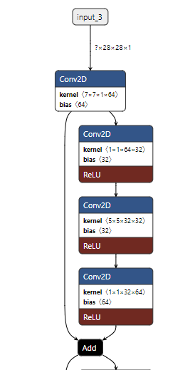
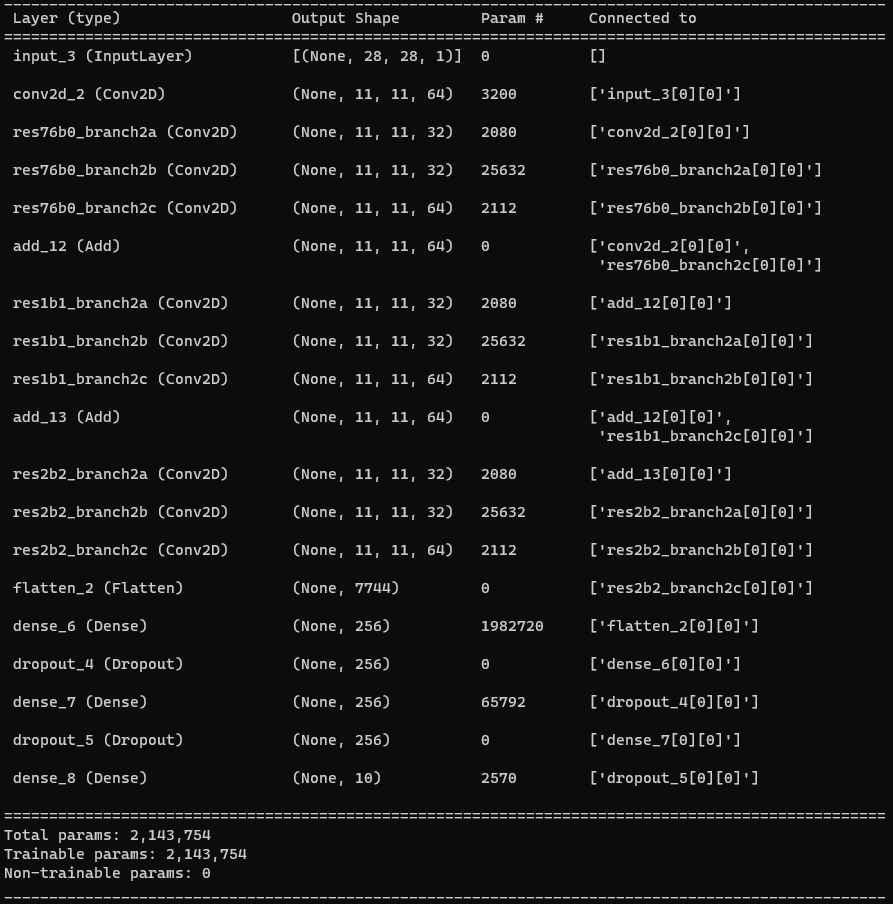
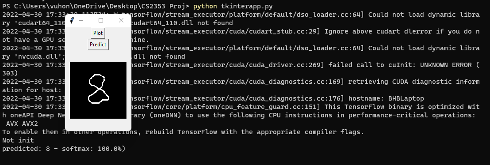
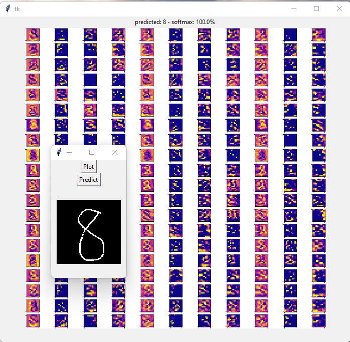

# Visualize MNIST ResNet Lite

## 1. Overall:
This is an implementation of a lite resnet architecture implemented using TensorFlow platform. 

I trained a model on the MNIST dataset to detect digits from 0 - 9 with input size is (28, 28, 1) - the last column indicate the grayscale channel.

The model implemented the skip connection concept from ResNet architecture with 3 blocks, here's the illustration of the first block using Netron


Here's the model summary:


## 2. Install requirements:
```pip install -r requirements.txt``` - (For Windows)

## 3. Using the app with two different inference mode:

First draw a digit from 0 - 9, those digit will then be inferred using the pretrained model ResNetLite
**Note: Please write it at the middle of the screen and avoid write at the border to improve the accuracy 

**Mode 1: Inference only:**

Select the predict method and you will see the prediction printed out on the command line



**Mode 2: Inference with plots:**

Select the plot method and you will see the plot generated in a new window. However, since the plot is using the library matplotlib, which require some times to generate the plot, you might need to wait around 5 - 10 seconds.


## 4. View the model:

In order to view the inference model, you can drag the LiteResNet.h5 model file to visualize it
[Lutz Roeder's Netron](https://netron.app/)

## 5. Things can do to improve:

Since the Tkinter canvas creates a white border when grab the image, so the accuracy might not be high overall. One way to do it is to improve the way I'm cropping the image at the center of the screen.

Other way to improve is to improve the drawing method, when we draw too fast, the canvas update slower than our gesture speed which will reduce the picture's quality overall.
